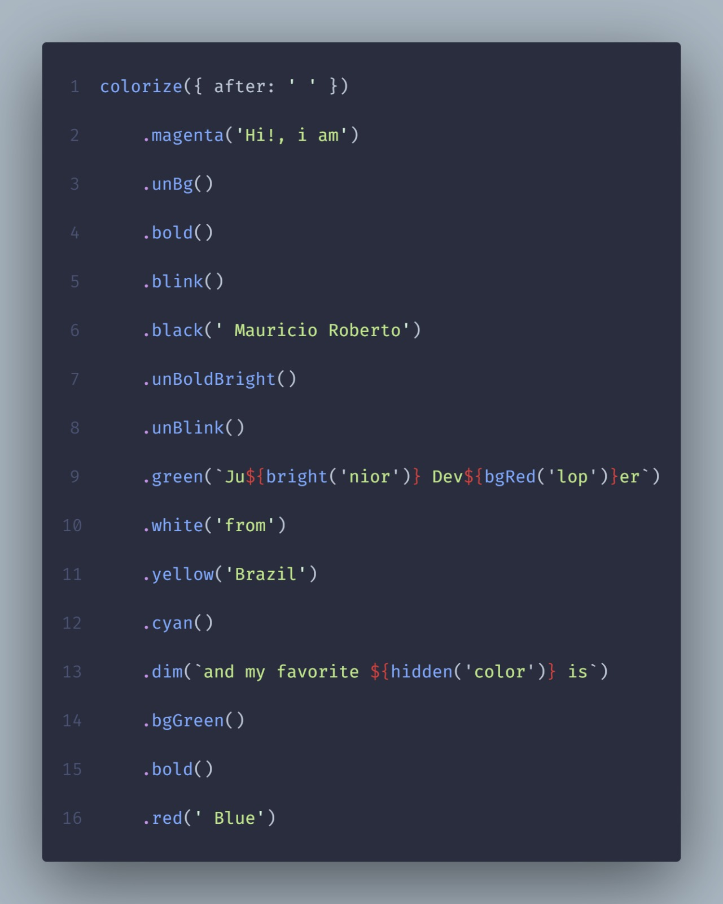
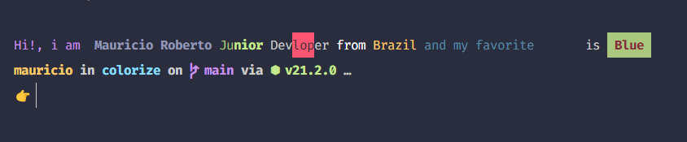

<div align="center">
  <h1>Colorize</h1>

  <p>
    An simple package to colorize strings with ANSI codes.
  </p>

<!-- Badges -->
<p>

  <a href="https://github.com/mauriciorobertodev/colorize/graphs/contributors">
    
  </a>
  <a href="">
    
  </a>
  <a href="https://github.com/mauriciorobertodev/colorize/network/members">
    
  </a>
  <a href="https://github.com/mauriciorobertodev/colorize/stargazers">
    
  </a>
  <a href="https://github.com/mauriciorobertodev/colorize/issues/">
    
  </a>
  <a href="https://github.com/mauriciorobertodev/colorize/blob/master/LICENSE">
    
  </a>
</p>

 

</div>

<br />

<!-- About the Project -->

## :star2: About project

An simple package to colorize strings with ANSI codes.

<!-- Features -->

### :dart: Features

-   Paint string with ANSI codes <br>

<!-- Usage -->

## :zap: How to use

Install the package

```bash
  npm install @mauricioroberto/colorize
```

Paint

```javascript
import { bgRed, bright, colorize, hidden } from '@mauricioroberto/colorize';

colorize({ after: ' ' })
    .magenta('Hi!, i am')
    .unBg()
    .bold()
    .blink()
    .black(' Mauricio Roberto')
    .unBoldBright()
    .unBlink()
    .green(`Ju${bright('nior')} Dev${bgRed('lop')}er`)
    .white('from')
    .yellow('Brazil')
    .cyan()
    .dim(`and my favorite ${hidden('color')} is`)
    .bgGreen()
    .bold()
    .red(' Blue');
```

<br/>

<!-- Run Locally -->

## :wrench: Development

Clone this project

```bash
  git clone https://github.com/mauriciorobertodev/colorize.git
```

Go to project folder

```bash
  cd colorize
```

Install dependencies

```bash
  npm install
```

Run dev mode

```bash
  npm run dev
```

<br>

<!-- Contributing -->

## :wave: Contribuindo

Contributions are always welcome!

1. Fork the project (https://github.com/mauriciorobertodev/colorize/fork)
2. Create a branch for your modification (`git checkout -b my-new-feature`)
3. Commit your changes (`git commit -am 'Adding a new feature...'`)
4. Push (`git push origin my-new-feature`)
5. Create a new Pull Request

</br>

<a href="https://github.com/mauriciorobertodev/colorize/graphs/contributors">
  
</a>
</br>

<br>

<!-- Contact -->

## :handshake: Contact

Mauricio Roberto - mauricio.roberto.dev@gmail.com

Link to the project on npmjs: [https://www.npmjs.com/package/@mauricioroberto/colorize](https://www.npmjs.com/package/@mauriciorobertodev/colorize)

<br>

<!-- Acknowledgments -->

## :gem: Credits

-   [Shields.io](https://shields.io/)
-   [Awesome Readme Template](https://github.com/Louis3797/awesome-readme-template)
-   [Emoji Cheat Sheet](https://github.com/ikatyang/emoji-cheat-sheet/blob/master/README.md#travel--places)

<br>

<!-- References -->

## :microscope: References

-   [Table of ANSI codes](https://gist.github.com/JBlond/2fea43a3049b38287e5e9cefc87b2124)
